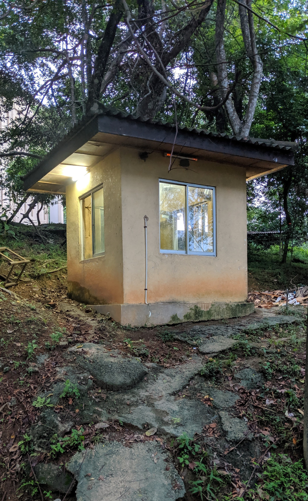
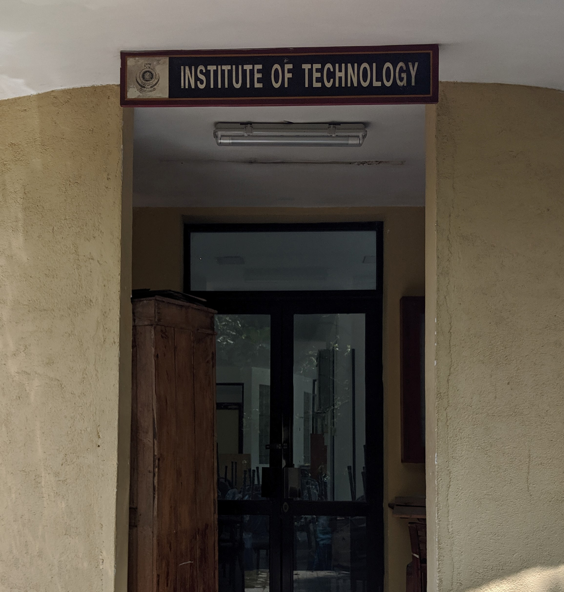
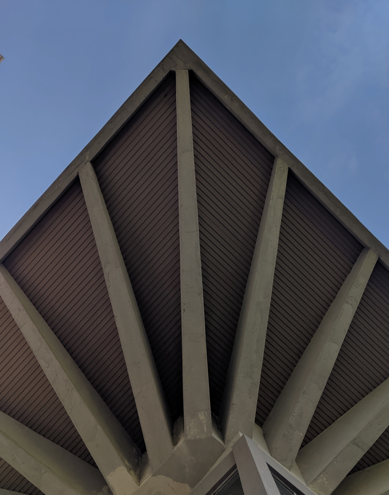
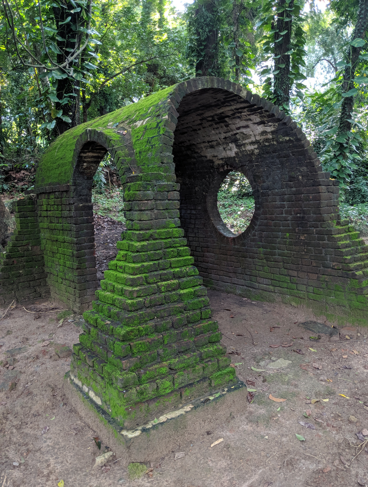
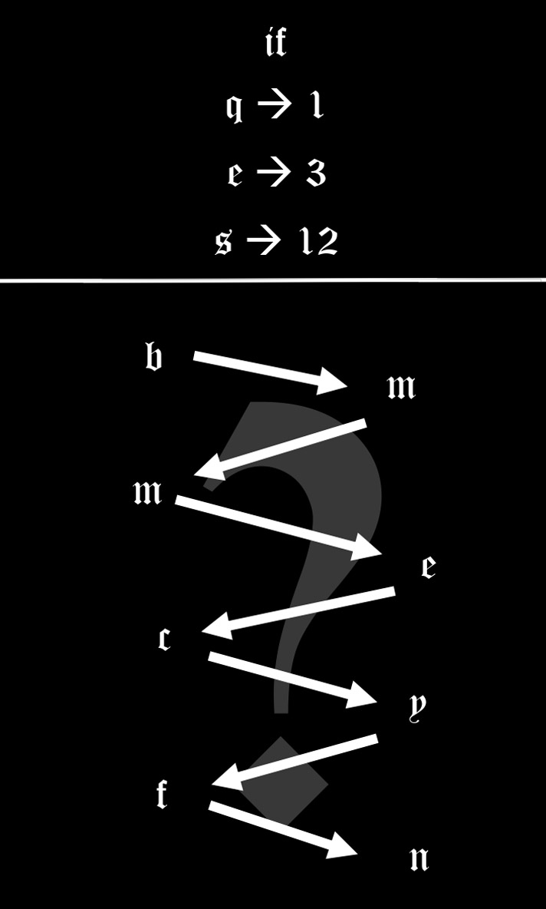

# CSE Night Invitation App [Scavenger Hunt]

Not all treasures are silver and gold, some are passageways to a wonderful and fun filled night.
Witness the digital scavenger hunt created by the students of batch 17, from Department of Computer Science and Engineering, University of Moratuwa.

Rise of Pharaohs : Where technology meets creativity

## How it was played

- First the students were given a invitation containing a QR code. It would lead to a [Google drive](http://bit.ly/2oCZqyw) folder containing this app.
- Then they were supposed to scan the university ID in order to login to the app. Here the app would scan for the bar-code in the id which would contain the student id. (Bar-code was in [Code 39](https://en.wikipedia.org/wiki/Code_39) format)
- After login each student was presented with 5 problems. These problems were taken from a pool of 5 groups where each group had 4 puzzles. Each person was presented with 5 puzzles where each puzzle each taken from a separate group. Each group contained a different type of puzzles.
  1. A poem
  2. A photo
  3. Simple math/IQ problem
  4. Treasure map
  5. Hieroglyphics
- Each puzzle would lead to a location and in that location there is a QR code that will unlock the next puzzle.
- Here, each person was given 5 problems which were generated by creating a random number sequence using his ID as the [seed](https://en.wikipedia.org/wiki/Random_seed). This was done do ensure that everyone would get a random but a unique set of puzzles.
- After someone finished the all set of puzzles assigned to him/her, the main progress will be increased by 1 and he/she would be added to the leader board. For everyone to proceed to the next stage, 30 people needed to complete the stage 1 puzzles. After 30 people completed all 5 puzzles, the next stage will be unlocked.
- In the second stage, the progress screen was converted into a button. (This would happen for everyone regardless whether he/she has completed the puzzles) After pressing the button  it, the app will be redirected to the `End of the line` screen. Here every person who finished the app were given a "secret key". Others were informed to complete the stage 1. There a link to the second [AR app](http://bit.ly/2C5wLVR) was also given.
  - The secret key was generated randomly in a simple manner.
  - First 9 numbers would contain a random number which contained the group the person belonged to. This was encoded using the remainder of the number by `99929`.
    - If remainder was `16561` - group 1 (Horus)
    - If remainder was `32183` - group 2 (Bastet)
    - If remainder was `77611` - group 3 (Osiris)
    - If remainder was `64577` - group 4 (Anubis)
  - Last 6 numbers revealed the index number. First, third and fifth numbers in the 6 letters revealed last numbers of the index when reduced by 1. (eg if index is `180345X` then last 6 numbers were `4?5?6?` where ? were random integers)
- In the second app, people were required to enter the "secret key" given by the first app. Then it would present a small AR game and it would then present the invitation. For more info see the repository of that app. [https://github.com/kdsuneraavinash/](https://github.com/kdsuneraavinash/)

## Test Details

### Test ID

### Test "Secret Key"

035506978179327

## Puzzles and solutions

### Level 1: The poem

Here each text would point to the correct location.

| Puzzle                                                       | Answer             | Location QR                                                  |
| ------------------------------------------------------------ | ------------------ | ------------------------------------------------------------ |
| The one who listen will often capture heavenly melodies as they float down. | "Gode uda" canteen |  |
| It stands tall overlooking spirited moves and weeps for its unfulfilled destiny.. | Iron auditorium    |  |
| Beware, for beyond these gates burns love, brighter than the flames it's known for.. | "Apaya"            |  |
| Rules are forged here, with iron voices.                     | "Lagaan"           |  |

### Level 2: Photo

Here the next QR will be on the location photographed.

| Puzzle                                  | Answer                             | Location QR                                                  |
| --------------------------------------- | ---------------------------------- | ------------------------------------------------------------ |
|  | Near the archi                     |  |
|  | Near the connecting bridge near EE |  |
|  | A building in the civil department |  |
|  | Near boatyard                      |  |

### Level 3: Numbers

Here a small puzzle based on numbers were given. The answers were required to enter in the accompanied screen to get the correct location name.

| Puzzle                                   | Answer                                                       | Location QR                                                  |
| ---------------------------------------- | ------------------------------------------------------------ | ------------------------------------------------------------ |
|  | `examhall`  Numbers in sequence of smaller number to bigger. |  |
|  | `oldgym` Binary code inverted                                |  |
|  | `boatyard` Accompanied number under the symbol in the keyboard |  |
|  | `backgate` Number above the letter in the keyboard           |  |

### Level 4: Treasure

Here a map of the location was given.

| Puzzle                                | Answer                         | Location QR                                                  |
| ------------------------------------- | ------------------------------ | ------------------------------------------------------------ |
|  | In the playground              |  |
|  | Near the L building            |  |
|  | Near the mechanical department |  |
|  | Near the civil (Tap)           |  |

### Level 5: Hieroglyphics

Here a set of Hieroglyphics were given. Everyone's invitation included 4 random characters and English letters. They were required to combine all letters to get the given location name.

| Puzzle                                                       | Answer        | Location QR                                                  |
| ------------------------------------------------------------ | ------------- | ------------------------------------------------------------ |
|  | Medi-center   |  |
|  | Pavilion      |  |
|  | "poshcanteen" |  |
|  | "walacanteen" |  |

